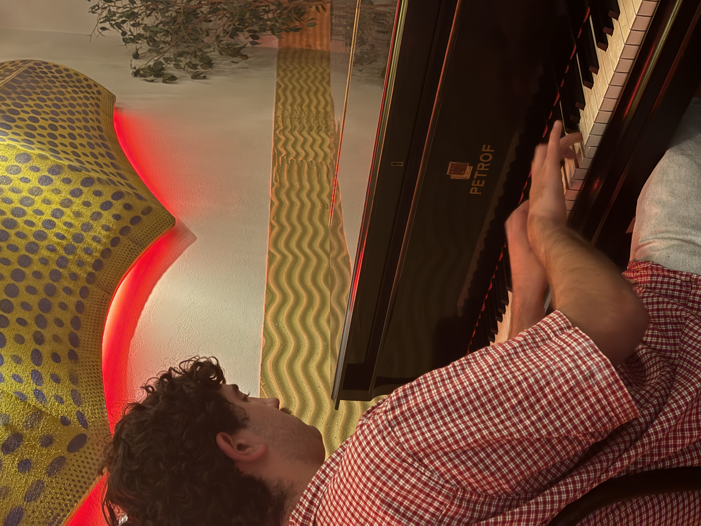

 

   
  

  

   <h1>Piano Lessons in Glasgow</h1>

  Friendly, flexible piano lessons for <strong>all ages and abilities</strong> across Glasgow and surrounding areas.  
  I can travel to your home to make lessons more convenient. 

    
  
  I teach all ages and abilities, with lessons for complete beginners or for those looking to prepare for exams. The lessons will be tailored to what you want, which could be learning songs or classical pieces or both!
  I can also teach music theory and sheet music reading if this is what you're interested in. 

     

  <a href="mailto:benheatherley@outlook.com" class="cta-button">Book a free 20‑minute trial lesson</a>
  

About Me

I have played piano for over <strong>15 years</strong>, achieving <strong>Grade 8 Piano (Distinction)</strong>, <strong>Piano Diploma (Distinction)</strong>, and <strong>Grade 8 Music Theory</strong>.  
I have taught piano to family and friends, and have experience teaching music theory in choir settings. I am now investing more time into teaching piano formally.

Here is a snippet of me playing an Elegie by Rachmaninoff in a competition a few years ago if you're interested in listening!
<audio src="Rachmaninoff Elegie.m4a" controls>
</audio>

I teach <strong>in your home</strong>, travelling across Glasgow and nearby areas.

Lesson Options

<h3>🎼 Beginner Lessons</h3>

Perfect for children or adults starting from scratch.  
Posture, hand position, rhythm, reading music, and simple pieces.

<h3>🎹 Adult Learners</h3>

Supportive, flexible lessons for adults learning for enjoyment or returning after a break.  
Choose your own music or follow a structured plan.

<h3>🎵 Pop / Film Music</h3>

Learn chords, patterns, playing by ear, and improvisation.

<h3>🎓 Exam Preparation (ABRSM / Trinity)</h3>

Technique, scales, sight‑reading, and exam pieces.  
I have experience teaching theory and can support students through Grade 5 Theory and beyond.

Lesson Length & Pricing

I use a <strong>sliding scale</strong> pricing system to make lessons accessible to students with different financial situations.  
This approach allows you to choose a rate within the range that feels fair and manageable for you, while still valuing the time, preparation, and travel involved in each lesson.  
It also reflects my belief that music education should be available to everyone, regardless of income.

All lesson lengths follow the same proportional scale:

<ul>
  <li><strong>30 minutes — £15 to £25</strong></li>
  <li><strong>45 minutes — £20 to £37.50</strong></li>
  <li><strong>60 minutes — £30 to £50</strong></li>
</ul>

I also offer a <strong>free 20‑minute trial lesson</strong> for new students.

Lessons take place in your home.  
Available evenings and weekends.
Message me to organise a time or have a chat!

Areas Covered

I travel to students across:

<ul>
  <li>Glasgow </li>
  <li>Surrounding areas depending on travel distance</li>
</ul>

If you're unsure whether you're within range, just ask.

Contact

To book a lesson or ask a question:

<ul>
  <li><strong>Email:</strong> benheatherley@outlook.com</li>
  <li><strong>Phone:</strong> 07864372587</li>
</ul>

<a href="mailto:benheatherley@outlook.com" class="cta-button">Book a free trial</a>

Find Me

Scan the QR code on my posters to visit this page anytime.

